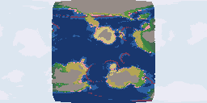

# The Biomes of Seed 42

The air organizes into a single day–night overturning (tidally locked); 9 land biomes and 7 marine biomes cover the globe.
Some 10% of the surface is habitable — land with water and a tolerable season.

```text
*******************^^^^^^^^^^^^^^^^^^^^^^^^^^^^^^^^^^*******************
******************kFff^f^^^^^^^^^^^^^^^^^^^^^^^^^^ttfk******************
******************_______-o^^^^^^^^^^^^^^^^^^wwWo-v___******************
******************v_-__--_----wooooowwo:ww:wo-__-w^f__******************
******************___________-:::-__________-wo-Wo--Ft******************
******************v____________:::o______________-Wof^******************
******************--v_________----o:..o___-v_____vooft******************
******************-_____________-..^^^..-o--__-::f^^^^******************
******************k______---____-.^^^^..-o:___:::f^^^^******************
******************__-__________-__-o.^..__-v___::ff^^^******************
******************_______________-___--_______--::fftt******************
******************k-_____________________________-wfft******************
******************________________________-vv________-******************
******************__________--___________--___________******************
******************______oo-ow-______v__-v_-___________******************
******************Fffww::::^:o-v_____-..ov___-w_______******************
******************t^^fw:^^^^::v_______:.:::^:::::w-___******************
******************t^^^^^^^^^:--______:.^^^^^^:::wwo--_******************
******************^^^^^^^^^:-_v______::^^^^^^^^^foW--_******************
******************ttfffw^^::^:o______o::^^^:oowwwwo_-v******************
******************tt^^^^^^^^wo_o--______-ww-___------k******************
******************-F--F---_______________________--Fkt******************
******************________________v_________________F^******************
*******************___________________________vvvvvvv*******************
```



> Rendered view — this raster's exact bytes are platform-local (pixel colors depend on the host math library) and are not cross-platform byte-checked; the page above is deterministic.

---

*Generated deterministically: this seed always yields this page.*
