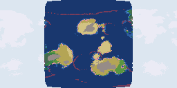

# The Biomes of Seed 42

The air organizes into a single day–night overturning (tidally locked); 10 land biomes and 7 marine biomes cover the globe.
Some 5% of the surface is habitable — land with water and a tolerable season.

```text
*******************__________________________________*******************
******************____________________________________******************
******************________________________________v__-******************
******************v_____________________vv_________-Ft******************
******************__________________________________Ft******************
******************t______________-:o:::_____________~^******************
******************-_v___________:....^.o_--v_____v___F******************
******************_____________:...^^^..-ow__________-******************
******************_____________o..^^^^.o_--________w_-******************
******************________________-_--_____v________--******************
******************_______________-_______.____________******************
******************_______________________-:.-_________******************
******************______:::-____________-....-________******************
******************_____w:::.:__________:o...:_________******************
******************Ffffw:::::.o______v_:ov.-___________******************
******************tt^^^^^:::::_v_____-..-v____w_______******************
******************tt^fw::::^:ov_______:._::^:::::w-___******************
******************tf^_-_-:::-_________..^^^^^:::www-__******************
******************t-_____--___v______::^^^^^^^^:wowo__******************
******************__v________________o:::^^:o-wwwwW__v******************
******************___v__________________oww-___--_____******************
******************____________________________________******************
******************________________v___________________******************
*******************___________________________vvvvvvv*******************
```



> Rendered view — this raster's exact bytes are platform-local (pixel colors depend on the host math library) and are not cross-platform byte-checked; the page above is deterministic.

---

*Generated deterministically: this seed always yields this page.*
