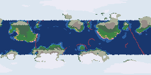

# The Biomes of Seed 42

The air organizes into 3 circulation band(s) per hemisphere; 11 land biomes and 8 marine biomes cover the globe.
Some 11% of the surface is habitable — land with water and a tolerable season.

```text
************************************************************************
************************************************************************
************************************************************************
************************************************************************
************************************************t***t,**,***************
*******************************,,,******************,***,***********,,,*
,-_***_**=--*-__*--*v__*___**_***k,*,=-***-**___*v--*,,,=__*-__**_,,^^,,
,___-k,,,,,,,,___v=____________-k,,^^,,,--k-__-,,,,^,^^,-__,,--____,^^,,
-____=tttttttt-__f~______---___-=,^^^^tf_-f-_-ttttt^^^^t-__ff--___-,^^tf
____-fff;tttttf____________________-"ttf___v__=ffttttttff-_f-____fftf~__
____WW__:ftttffw_________________-____________o:fffttffwf__-_____-W-____
_______=fffftfffwv-___________________________--wwoffffW___-___v________
_____--offffffffWv-________________________vv___--_-wo__________v_______
_____________W---__________________________________-____________________
________________________=fffF-______v_-~v_______________________________
________________f~=tft=ttttttf-v_____-ft-v____~___________________v_____
__--k,,t_______t,k,^^,,,,^,,,,,_______-t,k,^,,,,,,=_____________________
*kk,***,*___*__-tt,********,,-***__**k,^*****,,,,,k-*__*___*___**_***__*
***t*************,*********,*********t**********,*,,********************
*****************t,*,*****************,*******,**,**********,***,*******
************************************************************************
************************************************************************
************************************************************************
************************************************************************
```



> Rendered view — this raster's exact bytes are platform-local (pixel colors depend on the host math library) and are not cross-platform byte-checked; the page above is deterministic.

---

*Generated deterministically: this seed always yields this page.*
