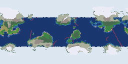

# The Biomes of Seed 42

The air organizes into 3 circulation band(s) per hemisphere; 11 land biomes and 8 marine biomes cover the globe.
Some 12% of the surface is habitable — land with water and a tolerable season.

```text
************************************************************************
************************************************************************
************************************************************************
************************************************************************
****************************************************t**********,*t******
*,*******,,,*****,t***************t*,,,*************************,,******
,,*******,,,*=_t,,-*v__*___**_**,,,,,*,***-**___*v__*t,,,,^**^,,*_***,,,
tt,,,,^^^^^^,____v_____________t,,,^^^,,-kt__________-,,,,,^^^,,k,,-t,kt
--tt,,ttttttt~_________________=tt^^^^t~_-=________f_=---fttttttttff--_-
Ffttt^tfff________________________-_=-_____v________---=~fftttff-_____--
_;;;ttf--oW______________________-_______f______________o_wffff=______w_
;ffwffo=oww______v_______________________-Wf-______________ffwov______ww
wf__ofwoW--______v______wwf-____________=fttf-__________________v______o
_-__--_________________WwfffW__________Wotttf___________________________
__________________F;;tttttfft~______v_F=vf-_____________________________
_______________-"",,^^^^^ttttf_v_____=ft-v____F___________________v_____
___=t,,t_______-,k,,^,,,,,,^,kv_______t,_,,^,,,,,,=_________-t-_________
*tk,^*^,t___*___*t,,^_=*-,,,*_***__**_,,^****,,,,,,-*__*__=,,**,,,,**__*
***t**************t******************,**********,*,********t,*****,,****
**********************************************,***,**************tt*****
************************************************************************
************************************************************************
************************************************************************
************************************************************************
```



> Rendered view — this raster's exact bytes are platform-local (pixel colors depend on the host math library) and are not cross-platform byte-checked; the page above is deterministic.

---

*Generated deterministically: this seed always yields this page.*
