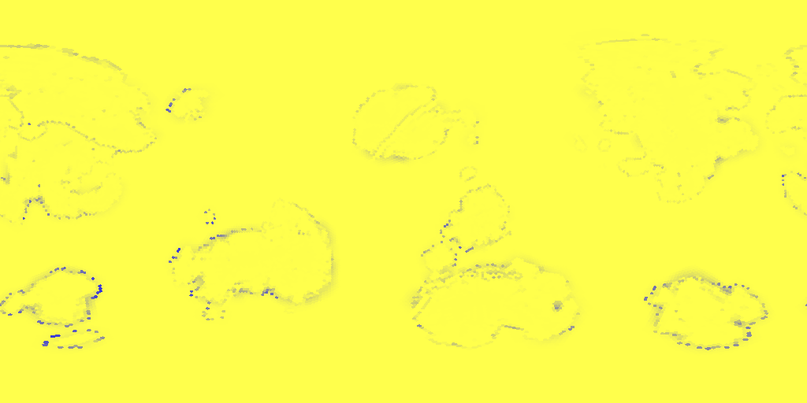

# The Land of Seed 42

The globe breaks into 16 plates; the sea claims 72% of its surface.
The highest land stands 4824 m above the sea.
Notable: the Great Delta, salt flats.

```text
~~~~~~~~~~~~~~~~~~~~~~~~~~~~~~~~~~~~~~~~~~~~~~~~~~~~~~~~~~~~~~~~~~~~~~~~
~~~~~~~~~~~~~~~~~~~~~~~~~~~~~~~~~~~~~~~~~~~~~~~~~~~~~~~~~~~~~~~~~~~~~~~~
~~~~~~~~~~~~~~~~~~~~~~~~~~~~~~~~~~~~~~~~~~~~~~~~~~~~~~~....~~~~~~~~~~~~~
+^^^^^+.~~~~~~~~~~~~~~~~~~~~~~~~~~~~~~~~~~~~~~~~~~~~..+++++++++~~~~~~~~+
+^AA^^^^^^+~~~~~~~~~~~~~~~~~~~~~~~~~~~~~~~~~~~~~~~~~.++^^++^^^~.+.~~~~~+
~+^AAAAA^+++~~~~~..~~~~~~~~~~~~~~~.~.+.~~~~~~~~~~~~~~^^^^^^^^^^^^+~~~~~~
++AAAAAA^^^+~~~.+.~~~~~~~~~~~~~~.+^+^A^~~~~~~~~~~~~~~.+^^^^^^^^.~~~~~+++
..^^^^AAAA^^.~~~~~~~~~~~~~~~~~~.+^^AA^^^~~~~~~~~~~~~~~.++^^^^^^+~+.~.+~.
~~+^^^^^^^^^+~~~~~~~~~~~~~~~~~~~+^AAAA+~~~.~~~~~~~~.~~~~~.^^^^^^^++.~~~~
..^^^A^+..~~~~~~~~~~~~~~~~~~~~~~~~~~~~~~~~~~~~~~~~~~~~~~~.+^^^++~~~~~~~~
~+^+^^+~~~.~~~~~~~~~~~~~~~~~~~~~~~~~~~~~~.~~~~~~~~~~~~~~~~.+++..~~~~~~.~
+++.^+~~~+.~~~~~~~~~~~~~~~~~~~~~~~~~~~~~~~.^~~~~~~~~~~~~~~~+++~~~~~~~~.+
.+~~~+.~.~~~~~~~~~~~~~~~.~+~~~~~~~~~~~~~~^^A^~~~~~~~~~~~~~~~~~~~~~~~~~~~
~~~~~~~~~~~~~~~~~~~~~~~..^+^.~~~~~~~~~~~~^^^+~~~~~~~~~~~~~~~~~~~~~~~~~~~
~~~~~~~~~~~~~~~~~~~+^^^^^^^^^~~~~~~~~~~~~+~~~~~~~~~~~~~~~~~~~~~~~~~~~~~~
~~~~~~~~~~~~~~~~+++^AAAA^^^^+.~~~~~~~~.+~~~~~~~~~~~~~~~~~~~~~~~~~~~~~~~~
~~~~.++.~~~~~~~~+~+^^^^+^^^^^~~~~~~~~~.+~.+A^^^.+.~~~~~~~~~~~+~~~~~~~~~~
~.~^^A^^~~~~~~~~~..+^~..~^^+~~~~~~~~~~^^^^AA^^+^+..~~~~~~~~+^AA^...~~~~~
~~~.^A^~~~~~~~~~~~~~~~~~~~~~~~~~~~~~~+^^^^^^^^^^+~.~~~~~~~~.+^AA^^++~~~~
~~~~~~~~~~~~~~~~~~~~~~~~~~~~~~~~~~~~~~++^^^+~~.+++.~~~~~~~~.+^^^^.~~~~~~
~~~~~~~~~~~~~~~~~~~~~~~~~~~~~~~~~~~~~~~~~..~~~~~~~~~~~~~~~~~..~...~~~~~~
~~~~~~~~~~~~~~~~~~~~~~~~~~~~~~~~~~~~~~~~~~~~~~~~~~~~~~~~~~~~~~~~~~~~~~~~
~~~~~~~~~~~~~~~~~~~~~~~~~~~~~~~~~~~~~~~~~~~~~~~~~~~~~~~~~~~~~~~~~~~~~~~~
~~~~~~~~~~~~~~~~~~~~~~~~~~~~~~~~~~~~~~~~~~~~~~~~~~~~~~~~~~~~~~~~~~~~~~~~
```



> Rendered view — this raster's exact bytes are platform-local (pixel colors depend on the host math library) and are not cross-platform byte-checked; the page above is deterministic.

---

*Generated deterministically: this seed always yields this page.*
