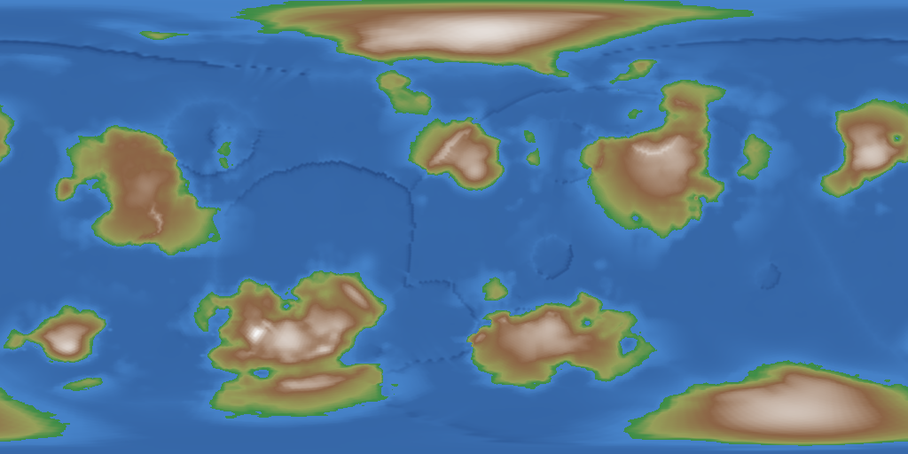

# The Land of Seed 42

The globe breaks into 16 plates; the sea claims 73% of its surface.
The highest land stands 5183 m above the sea.
Notable: the Great Delta, salt flats.

```text
~~~~~~~~~~~~~~~~~~~....+++^^^^^^^^^^^^^^^^^^^^^^^++++++....~~~~~~~~~~~~~
~~~~~~~~~~~~~~~~~~~~..+.++^^^AAAAAAAAAAAAAAAA^^^++..~~~~~~~~~~~~~~~~~~~~
~~~~~~~~~~~~~~~~~~~~~~~~~~~+^AAAAAAAAAAAA^^++..~~~~~~~~~~~~~~~~~~~~~~~~~
~~~~~~~~~~~~~~~~~~~~~~~~~~~~~~~~~~~~~~~...++~~~~~.+.~~~~~~~~~~~~~~~~~~~~
~~~~~~~~~~~~~~~~~~~~~~~~~~~~~~++~~~~~~~~~~~~~~~~~~~~..+..~~~~~~~~~~~~~~~
~~~~~~~~~~~~~~~~~~~~~~~~~~~~~~~+.+~~~~~~~~~~~~~~~~~~+^^^.~~~~~~~~~~~...~
+~~~~~~~~~~~~~~~~~~~~~~~~~~~~~~~~~.~+~~~~~~~~~~~~~~~~^^^~~~~~~~~~~+^^^^^
.~~~~~.++^^^+~~~~~~~~~~~~~~~~~~~~++AA^^+~~~~~~~++^^^^A^^~~~+.~~~~~~^AA^+
~~~~~~++^^^^^^~~~.~~~~~~~~~~~~~~.+AAAA^.~~.~~~+^^^^AAAA^~~~..~~~~~~^AA^.
~~~~~..~+^^^^^.~~~~~~~~~~~~~~~~~~~~~+^^.~~~~~~~+^^^AAA^^.~~.~~~~~+^^.~~~
~~~~..~~.^^^^^+.~~~~~~~~~~~~~~~~~~~~~~~~~~~~~~~.++^^^^+.+~~~~~~~~~.~~~~~
~~~~~~~~+^^^A^^++~~~~~~~~~~~~~~~~~~~~~~~~~~~~~~~.+~++++.~~~~~~~~~~~~~~~~
~~~~~~~~++^^^+++.~~~~~~~~~~~~~~~~~~~~~~~~~~~~~~~~~~~.~~~~~~~~~~~~~~~~~~~
~~~~~~~~~~~~~.~~~~~~~~~~~~~~~~~~~~~~~~~~~~~~~~~~~~~~~~~~~~~~~~~~~~~~~~~~
~~~~~~~~~~~~~~~~~~~~~~~~~+...~~~~~~~~~~~~~~~~~~~~~~~~~~~~~~~~~~~~~~~~~~~
~~~~~~~~~~~~~~~~.~~^++~+^+^^^.~~~~~~~~.+~~~~~~~~~~~~~~~~~~~~~~~~~~~~~~~~
~~~~~+..~~~~~~~.+~+^^^++^^^^^^.~~~~~~~~..~+A^+^++.~~~~~~~~~~~~~~~~~~~~~~
~~~^AAA^~~~~~~~~.+^AAAAAAAA^~~~~~~~~~~^^^AAAA^+^++~~~~~~~~~~~~~~~~~~~~~~
~~~.AA^~~~~~~~~~~^^^^AAAAA^.~~~~~~~~~.^^^AAAA^^^^~..~~~~~~~~~~~~~~~~~~~~
~~~~~~~~~~~~~~~~~..+.+++^+++^+~~~~~~~~++^^^+~~.++.~~~~~~~~~~.+++~~~~~~~~
~~~~~~..~~~~~~~~~.+++^^AA^^^++~~~~~~~~~~~~.~~~~~~~~~~~~+++^^^^AAAAA^^^+.
+..~~~~~~~~~~~~~~....+++++...~~~~~~~~~~~~~~~~~~~~~~~~++^^AAAAAAAAAAAA^^+
^+++.~~~~~~~~~~~~~~~~~~~~~~~~~~~~~~~~~~~~~~~~~~~~...++^^^^^AAAAAAAAA^^^^
~~~~~~~~~~~~~~~~~~~~~~~~~~~~~~~~~~~~~~~~~~~~~~~~~~~~~..~~~~...+++~~~~~~~
```



> Rendered view — this raster's exact bytes are platform-local (pixel colors depend on the host math library) and are not cross-platform byte-checked; the page above is deterministic.

---

*Generated deterministically: this seed always yields this page.*
