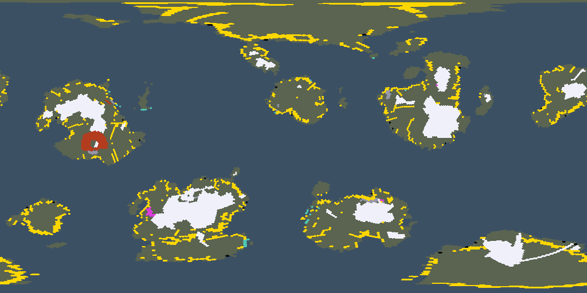

# The Land of Seed 42

The globe breaks into 16 plates; the sea claims 73% of its surface.
The highest land stands 5605 m above the sea.
Notable: the Great Delta, salt flats.

```text
~~~~~~~~~~~~~~~~~..+++++++^^^^^^^^^^^^^^^^^^^^^^^^^^^++++++...~~~~~~~~~~
~~~~~~~~~~..~~~~~~~.+++++^^^^AAAAAAAAAAAAAAAAA^^^+++.~~~~~~~~~~~~~~~~~~~
~~~~~~~~~~~~~~~~~~~~~~~~~~~^^AAAAAAAAAAAA^^^++..~~~~~~~~~~~~~~~~~~~~~~~~
~~~~~~~~~~~~~~~~~~~~~~~~~~~~~~.~~~~~...+.+++~~~~~.^+~~~~~~~~~~~~~~~~~~~~
~~~~~~~~~~~~~~~~~~~~~~~~~~~~~~++.~~~~~~~~~~~~.~~.~~~.+...~~~~~~~~~~~~~~~
~~~~~~~~~~~~~~~~~~~~~~~~~~~~~~~...~~~~~~~~~~~~~~~~.~+AA^.~~~~~~~~~~~...~
+~~~~~~~~.~~~~~~~~~~~~~~~~~~~~~~~~~~++~~~~~~~~~~~~~~.^^^~~~~~~~~~~+^^^^^
.~~~~~.+^^^^^.~~~~~~~~~~~~~~~~~~~.^AAA^+~~~~~~~+^^^AAAA^~~~+~~~~~~~^AA^^
~~~~~~+^^^^^^^~~~+~~~~~~~~~~~~~~~+AAAA^+~~.~~~.^^^AAAAA^~~~+~~~~~~~^AA^+
~~~~~++.+^^AA^+~~~~~~~~~~~~~~~~~~~~~^A^+~~~~~~~.^^AAAA^^+~~~~~~~~+^^+.~~
~~~~..~~.^AA^^++~~~~~~~~~~~~~~~~~~~~~~~~~~~~~~~~+^^^^^+.+~~~~~~~~~~~~~~~
~~~~~~~~+^^^A^^^+.~~~~~~~~~~~~~~~~~~~~~~~~~~~~~~~~.+^^++~~~~~~~~~~~~~~~~
~~~~~~~~+^^^^^++~~~~~~~~~~~~~~~~~~~~~~~~~~~~~~~~~~~~~~~~~~~~~~~~~~~~~~~~
~~~~~~~~~~~~~.~~~~~~~~~~~~~~~~~~~~~~~~~~~~~~~~~~~~~~~~~~~~~~~~~~~~~~~~~~
~~~~~~~~~~~~~~~~~~~~~~~~~~~~.~~~~~~~~~~~~~~~~~~~~~~~~~~~~~~~~~~~~~~~~~~~
~~~~~~~~~~~~~~~~~~.^+^.+^+^^^.~~~~~~~~.+~~~~~~.~~~~~~~~~~~~~~~~~~~~~~~~~
~~~~~+.~~~~~~~~~..+AA^++AA^^^+~~~~~~~~.+..^A^^^++.~~~~~~~~~~~~~~~~~~~~~~
~~.^AAA^.~~~~~~~.+^AAAAAAAA^.~~~~~~~~.^^AAAAA^^^++~~~~~~~~~~~~~~~~~~~~~~
~~~+AA^~~~~~~~~~.^^^AAAAAA^+~~~~~~~~~+^^AAAAAA^^^~.~~~~~~~~~~~~~~~~~~~~~
~~~~~~~~~~~~~~~~..+^++^^^^++^+~~~~~~~~+^^^^+~~.^+.~~~~~~~~~.++^++.~~~~~~
~~~~~~~~~~~~~~~~~.++^^AAAA^^+~~~~~~~~~~~~~~~~~~~~~~~~~.++^^^^AAAAAA^^+.~
+~~~~~~~~~~~~~~~~~~~~~~~~~~~~~~~~~~~~~~~~~~~~~~~~~~~~+^^^AAAAAAAAAAAA^^^
^^.~.~~~~~~~~~~~~~~~~~~~~~~~~~~~~~~~~~~~~~~~~~~~~~~~.+^^^^AAAAAAAAAAA^^^
~~~~~~~~~~~~~~~~~~~~~~~~~~~~~~~~~~~~~~~~~~~~~~~~~~~~~~~~~~~...+++.....~~
```



> Rendered view — this raster's exact bytes are platform-local (pixel colors depend on the host math library) and are not cross-platform byte-checked; the page above is deterministic.

---

*Generated deterministically: this seed always yields this page.*
