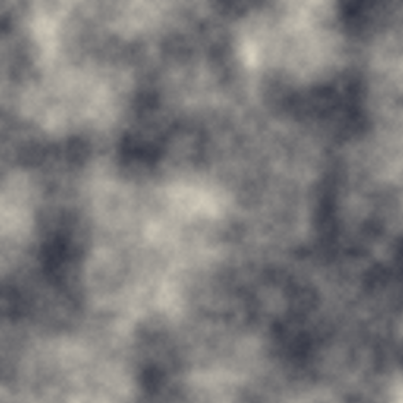

# First Light (seed 42)

Every campaign must end with artifacts — things you can look at that
demonstrate what now exists. These are Campaign 1a's, and they are
deliberately humble: a substrate showing its two faces.

Both artifacts are **generated, not authored**: rerunning the generator
produces these exact bytes, every time, on any machine. When a future change
alters either one, that diff *is* the news that behavior changed.

## The prior: seed 42's noise field

Five octaves of value noise over the terrain stream of seed 42 — the raw
statistical substance that terrain, climate, and eventually the tides of
history will be carved from. No world has interpreted it yet; this is what
potential looks like before meaning arrives.

## The posterior: the world of seed 42

{{#include world-seed-42.md}}

---

*Two entities, two facts, one belief, and a proof of sameness. Campaign 1b
gives this world a sky that moves, land with shape, more goblins, and its
first real almanac.*
