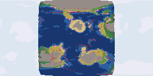

# The Peoples of Seed 42

The land holds 29 settlement(s).
The chief bugbear settlement, Shngaoshngaash, holds 406 souls amid temperate-forest.
The chief goblin settlement, Xngatnebvned, holds 522 souls amid temperate-rainforest.
The chief hobgoblin settlement, Ttoemjeo, holds 382 souls amid temperate-forest.
The chief kobold settlement, Rotrarogroq, holds 404 souls amid temperate-rainforest.

```text
                                                                        
                                                                        
                                                                        
                                                                        
                   o    o                    o                          
                                               o                        
                   o  o                                                 
                                                o                       
                     o                                                  
                  o   o                          o                      
                    o                            o                      
                                                                        
                  o                                o                    
                     o                               o                  
                                                                        
                   o  o                           o @                   
                                                o                       
                                                                        
                                               o                        
                                                                        
                                       o       o                        
                                    o                                   
                           o                      o                     
                                                                        
```



> Rendered view — this raster's exact bytes are platform-local (pixel colors depend on the host math library) and are not cross-platform byte-checked; the page above is deterministic.

---

*Generated deterministically: this seed always yields this page.*
