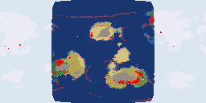

# The Peoples of Seed 42

The land holds 278 settlement(s).
The chief bugbear settlement, Goodo, holds 110 souls amid tropical-rainforest.
The chief gnoll settlement, Pzopdzhaxzngavsma, holds 112 souls amid tropical-seasonal-forest.
The chief goblin settlement, Beobee, holds 89 souls amid tropical-seasonal-forest.
The chief hobgoblin settlement, Geoge, holds 82 souls amid tropical-seasonal-forest.
The chief kobold settlement, Raxarora, holds 117 souls amid tropical-rainforest.

```text
                                                                        
                    ooooooooo                                           
                         ooooo               o o@                       
                                                                        
                                                                        
                                                    o                   
                                                   oo                   
                                                   oo                   
                                                                        
                                                                        
                                                                        
                                                                        
                                                                        
                                                                        
                   oo                                                   
                   ooo                                                  
                                                 o                      
                                                                        
                                                                        
                   ooooo                                                
                    ooo ooooo                                           
                       ooooo                                            
                                                                        
                                                                        
```



> Rendered view — this raster's exact bytes are platform-local (pixel colors depend on the host math library) and are not cross-platform byte-checked; the page above is deterministic.

---

*Generated deterministically: this seed always yields this page.*
