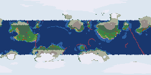

# The Peoples of Seed 42

The land holds 66 settlement(s).
The chief goblin settlement, Nobzxekngatnoenoa, holds 2 souls amid temperate-forest.
The chief hobgoblin settlement, Mjaamjaenoenoanoagoo, holds 17 souls amid temperate-forest.

```text
                                                                        
                                                                        
                                                                        
                                                                        
                                                                        
                                                                        
                                                                        
                                                                        
                 oo              o        o   o                       oo
     oo oo                       ooo o o               o   o     o ooo  
         o  o   o                                o     oo         o     
         o   o@                                     oo o                
         oooo    o                                                      
                                                                        
                   oo   ooo                                             
                o  o o o o             o                                
                                                                        
                                                                        
                                                                        
                                                                        
                                                                        
                                                                        
                                                                        
                                                                        
```



> Rendered view — this raster's exact bytes are platform-local (pixel colors depend on the host math library) and are not cross-platform byte-checked; the page above is deterministic.

---

*Generated deterministically: this seed always yields this page.*
