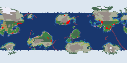

# The Peoples of Seed 42

The land holds 134 settlement(s).
The chief bugbear settlement, Googo, holds 68 souls amid tropical-rainforest.
The chief gnoll settlement, Dsaap, holds 42 souls amid temperate-forest.
The chief goblin settlement, Teona, holds 39 souls amid temperate-forest.
The chief hobgoblin settlement, Neneonetea, holds 77 souls amid temperate-forest.
The chief human settlement, Ngama, holds 34 souls amid temperate-forest.
The chief kobold settlement, Raaxora, holds 47 souls amid temperate-forest.

```text
                                                                        
                                                                        
                                                                        
                                                                        
                                                                        
                                                                        
                                                                        
                                                        o               
        o                             oo               oo               
                                  oo   o               ooo           o  
             oo                                       o                 
           o                                                            
          ooooo@o                                                       
            ooo                                                         
                                                                        
                    o                                                   
                                                                        
                                                                        
                                                                        
                                                                        
                                                                        
                                                                        
                                                                        
                                                                        
```



> Rendered view — this raster's exact bytes are platform-local (pixel colors depend on the host math library) and are not cross-platform byte-checked; the page above is deterministic.

---

*Generated deterministically: this seed always yields this page.*
