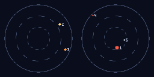

# The Night Sky of Seed 42

The sun is a yellow dwarf (G).

```text
                                                                        
                                                                        
                                                                        
                                                                        
                                                                        
                                                                        
                                                                        
                                                                        
                                                                        
      2                                                                 
                                                                   3    
                                                                        
- - - - - - - - - - - - - - - - - - - - - - -4- - - - - - - - - - - - - 
                                                                        
                                                                        
                                                                        
                                                                        
                                                                        
                                                                        
                                                                        
  5             1                                                       
                                                                        
                                                                        
                                                                        
```

1. A red giant — smoldering red, 68.2 light-years away, apparent brightness 0.064.
2. A sun-like star — warm yellow, 4.1 light-years away, apparent brightness 0.058.
3. An orange giant — deep orange, 39.1 light-years away, apparent brightness 0.039.
4. A red dwarf — dim red, 57.7 light-years away, apparent brightness 0.000.
5. A white dwarf — pale white, 67.0 light-years away, apparent brightness 0.000.

Moon 1 (vast): `oo))))))OO((((oo` — one cycle every 16.7 standard days.
Moon 2 (small, distant): `oo))))))OO((((oo` — one cycle every 35.7 standard days.



> Rendered view — this raster's exact bytes are platform-local (pixel colors depend on the host math library) and are not cross-platform byte-checked; the page above is deterministic.

---

*Generated deterministically: this seed always yields this page.*
