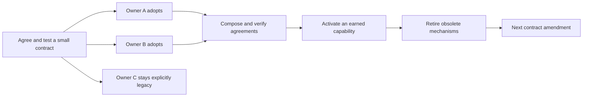

# Federated development — program metaplan

Status: proposed for G3 review, 2026-09-04. This is a direction and amendment
framework, not an enacted replacement for the Constitution or current gates.
First campaign: [The Charter](2026-09-04-the-charter-design.md).
Decision trail: [campaign ledger](../ledgers/2026-09-04-the-charter.md).

## 1. Purpose

Make it possible for independent campaigns to improve both the simulation
and its development process without repeatedly editing the same central
vocabulary, dispatcher, instruction file, or migration checklist.

The organizing unit is a locally owned contribution with a public contract.
It can describe a simulation domain, a workflow rule, a verification method,
an idea, or a view. The shared infrastructure recognizes identity,
compatibility, obligations, and evidence; local owners retain their own
meaning and implementation. A Rust crate is one useful boundary, not proof
that two changes are semantically independent.

The program builds on The Digest, the existing layered simulation, the
manifest/concept registry, and the Sluice. It does not require replacing Git,
adopting Jujutsu, introducing dynamic simulation plugins, or moving project
management into the kernel. Those are separable choices.

## 2. The eight evolution rules

These are proposed constraints for future campaigns. Activation requires an
approved campaign and normal integration; writing a rule here does not grant
the development tools new authority.

1. **Keep the shared contract small.** Standardize namespaced identity,
   compatible imports/exports, evidence references, and explicit ownership.
   A contributor owns its semantic vocabulary, checks, and presentation.
   A new central field must serve demonstrated independent consumers.
2. **Separate intent, implementation, evidence, and views.** Authored
   obligations say what should hold; code implements behavior; an instrument
   observes a specified property; generated prose exposes those distinctions.
   Agreement between two renderings is a drift check, not corroboration of
   the underlying claim. The implementation cannot define its own correctness
   merely by describing what it does.
3. **Adopt locally; activate explicitly.** An unenrolled scope remains
   visibly legacy. A scope can declare a contract, acquire checks, and later
   earn a specific admission privilege. Evidence being current, stale, absent,
   or contradicted is a separate dimension. No global adoption percentage
   makes a particular change safe.
4. **Ratchet obligations at the boundary.** Newly enrolled exports and new
   cross-module dependencies meet the adopted contract. Legacy exceptions
   name their scope, rationale, owner, and reopening condition. Touching an
   affected subject reopens its relevant exception, not every unrelated
   debt. A ratchet preserves the obligation; it need not preserve the number
   of tests, policy paragraphs, or obsolete mechanisms.
5. **Declare effects and small cross-module agreements.** A change that
   alters a save contract, stream consumption, interpretation, artifact
   authority, or shared assumption declares that effect even when all edits
   fit inside one directory. Two owners can version a narrow agreement
   without first creating a universal ontology. An unresolved disagreement
   remains visible; file order never adjudicates it.
6. **Earn narrower verification with evidence.** Proposed check selection
   first runs in observation mode alongside the accepted gate. Complete
   relevant inputs include imports, rules, generator/checker versions,
   configuration, environment where material, and negative dependencies
   such as “no implementation exists.” Reuse is allowed only under an
   approved soundness argument and measured counterexamples. Unknown scope
   falls back to accepted broader verification.
7. **Amend under accepted authority.** A candidate cannot weaken a checker
   and use only the weakened checker to approve itself. Expand compatible
   versions, let owners migrate independently, verify consumers, activate
   the new contract, then retire the old version. Changed rules are reviewed
   against the previously accepted rules and explicit amendment criteria.
8. **Keep consequential actions explicit.** Tools can compose proposals,
   evaluate contracts, and generate views. The current operator still
   authorizes and performs its consequential action. Source integration and
   canonical-world activation may eventually have different cadences, but
   splitting them requires an approved design that preserves epoch, census,
   and exact-tested-merge guarantees.

## 3. Concurrent work with a small sequential spine

Each expansion follows this shape:

The sequential work establishes meanings and judges their composition.
The parallel work implements those meanings locally. Enrollment should not
require each owner to change one central dispatch table. Shared dependency
resolution, generated aggregates, and semantic disagreements still require
integration. A clean textual merge is insufficient evidence of a correct
generated aggregate, as the board's Radiation report illustrates.

Agents coordinate through declared owned scopes, imports, proposed shared
effects, evidence needs, and durable decisions. The existing board remains
the coordination transport initially; a later adapter can derive notices
or detect conflicts from these records. No new chat system is prerequisite.

## 4. Candidate campaign sequence

These are dependency boundaries and questions, not approved implementation
plans or promises that each row is one campaign.

| Expansion | Local work that can proceed independently | Evidence required to advance |
|---|---|---|
| **The Charter** | Thing and census-publication contributors after one protocol bootstrap | Useful checked context; independent package additions; deterministic composition and refusal of contradictory identities |
| Persistent views and idea lifecycle | Bounded prompt sections, Book views, idea/decision adapters, native language realizers | Generated facts have authoritative sources; prose preserves assertion/observation distinctions; each adopted surface has one writer and a drift check |
| Local contracts and migration | Other modules declare exports/imports, versions, exceptions, owned artifacts | A real incompatible amendment survives expand/migrate/activate/retire without a whole-repo flag day |
| Evidence and test orchestration | Owners declare check inputs and effects; instruments expose counterexamples and costs | Shadow selection catches accepted regressions; input closure includes new/negative dependencies; omission/reuse rules reviewed under existing authority |
| Earned admission and activation | Eligible scopes use narrowly granted paths; other scopes retain existing gates | Measured throughput improvement with preserved behavioral, determinism, artifact, and statistical obligations |

Formal methods belong where a contract is small enough to model and its
failures consequential: queue ownership/recovery, schema transitions,
deterministic ordering, or a compatibility predicate. Model checking,
property testing, mutation testing, differential testing, and censuses offer
different evidence. A proof of a model needs an explicit link to the code
it constrains; no chosen proof assistant is a program prerequisite.

Crate restructuring follows demonstrated dependency and build costs. A
plugin name does not repair a broad compilation unit or an entangled API.
Likewise, keep the census's statistical coverage while investigating its
selection, sharding, incremental derivations, and scheduling separately.
Changing a measurement instrument and changing the world it measures are
different amendments.

## 5. How to tell whether the program helps

Establish measurements before setting targets. Track shared files and core
edits per new adopter, conflict/reconciliation effort, gate wait versus
execution, cold/warm contributor build cost, time to obtain relevant context,
and detected stale or contradictory claims. Track false negatives and
unknown cases when verification selection is trialed. Record failures and
rollbacks as well as successes.

Do not use compilation success, adoption percentage, generated word count,
or reduced test count as a proxy for achieved correctness. The important
experiment is whether independent owners can safely add useful behavior
with less coordination while retaining the obligations that matter.

## 6. Capture and existing homes

The new registry entries are `PROC-federated-evolution`,
`PROC-knowledge-contributions`, `PROC-evidence-selects-obligations`, and
`PROC-local-adoption-and-activation`. They record proposals, not shipped
capabilities.

Existing homes remain authoritative for overlapping directions:

| Direction | Existing registry home |
|---|---|
| Development knowledge in code and generated language | `PROC-codification`, `PROC-11`, `UNI-28`, `UNI-29` |
| Assertion, observation, and judgment | `PROC-project-epistemology` |
| Registry queries and derived links | `TOOL-registry-query`, `TOOL-registry-derived-edges`, `PROC-registry-connectivity` |
| Evidence freshness and reusable results | `PROC-a-parked-finding-carries-no-use-by-date`, `TOOL-verdict-cache` |
| Reopening and retiring obligations | `PROC-deferral-needs-a-watcher`, `PROC-provisional-decisions`, `PROC-suite-life-cycle`, `PROC-waiver-ceiling` |
| Keeping the kernel and knowledge models honest | `DOM-kernel-owns-vocabulary`, `UNI-record-shape`, `PROC-a-ruling-is-not-a-build` |

Rejected as prerequisites: a universal project ontology, full runtime plugin
loading, immediate gate relaxation, and a VCS migration. These may be
reconsidered for their own demonstrated benefits; none substitutes for
semantic contracts or verification of the composed result.
